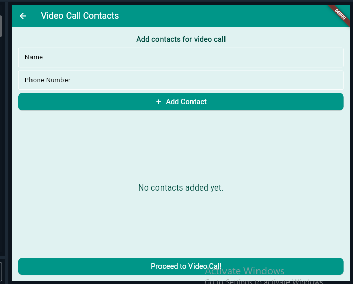
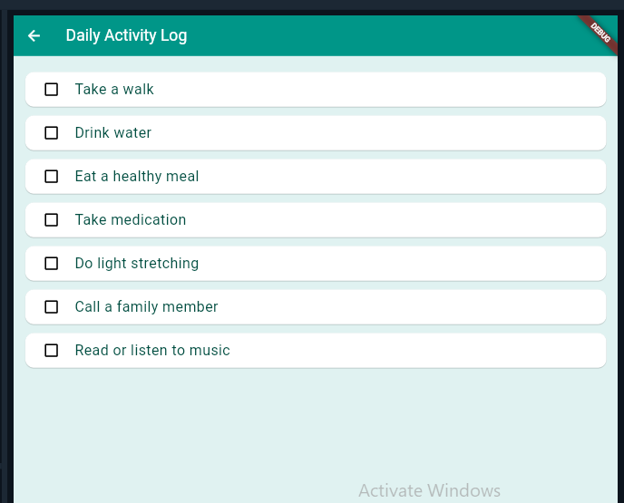
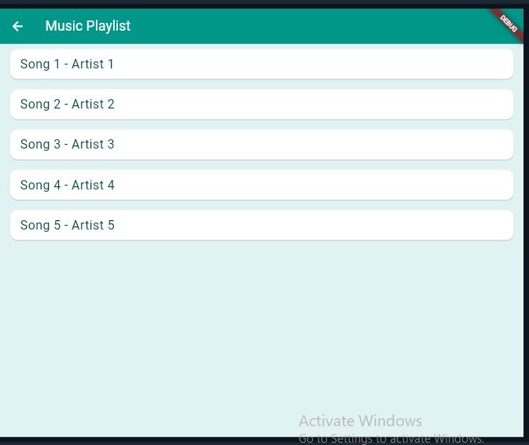
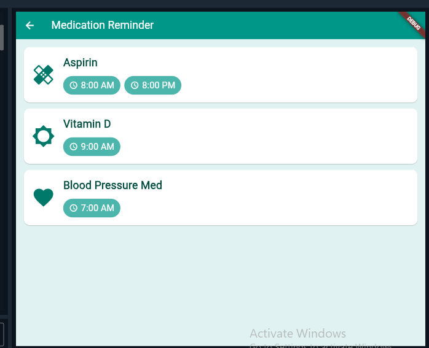
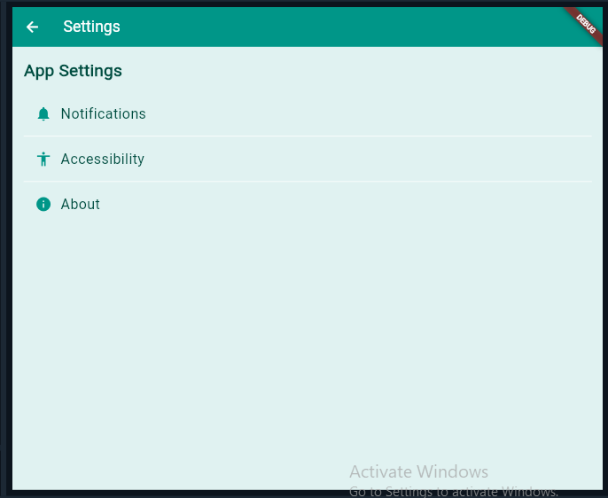
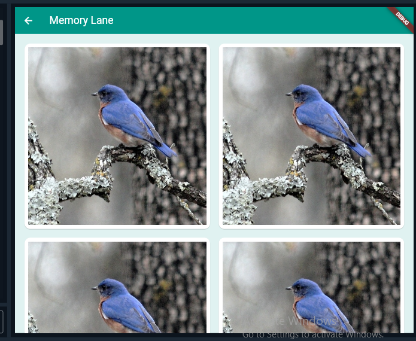
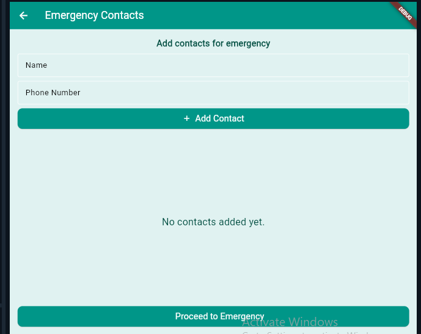
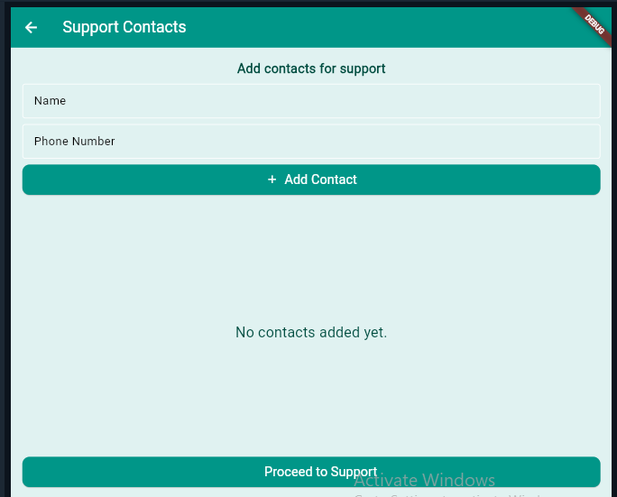

# CompanionCare 👵👴

An accessible, high-contrast Flutter application prototype specifically designed for senior citizens. Built to simplify daily workflows, track health metrics, and maintain close connections with loved ones.

## 📱 Main Application Screens

| Welcome Screen | Home Dashboard | Wellness Check-In |
| :---: | :---: | :---: |
|  |  |  |

---

## 🛠️ Feature & Sub-Screen Deep Dive

| Media & Contacts | Medication & Logs | Settings & Assistance |
| :---: | :---: | :---: |
|  |  |  |
|  |  |  |
|  |  | |

### ✨ Key Features Implemented
* **Accessible UI:** Large touch targets, readable text formatting, and high-contrast color choices tailored for elderly users.
* **Daily Check-ins:** Fast, intuitive mood logging system with instant dialog feedback.
* **Medication Tracker:** Clear visual cards displaying custom prescription schedules and alert times.
* **Gesture Navigation:** Smart horizontal swipe shortcuts built into the homepage for fast access to your media tools.
* **Dynamic Contact Directories:** Custom entry forms with active field validation for managing emergency, video, and support contacts.

---

## 💻 Tech Stack & Architecture

* **Framework:** Flutter (Dart)
* **Design Philosophy:** Human-Centered Design / Accessibility-First
* **Structure:** Single-file rapid prototype (Optimized for execution in sandboxed environments like DartPad)

---
*Developed as a prototype for elder care accessibility.*
